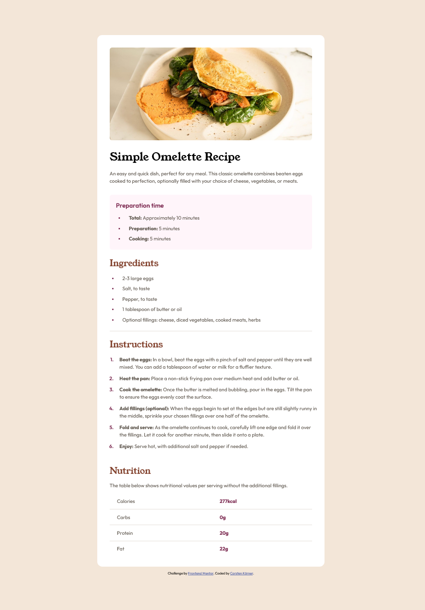

# Frontend Mentor - Recipe page solution

This is a solution to the [Recipe page challenge on Frontend Mentor](https://www.frontendmentor.io/challenges/recipe-page-KiTsR8QQKm). Frontend Mentor challenges help you improve your coding skills by building realistic projects. 

## Table of contents

- [Overview](#overview)
  - [The challenge](#the-challenge)
  - [Screenshot](#screenshot)
  - [Links](#links)
- [My process](#my-process)
  - [Built with](#built-with)
  - [What I learned](#what-i-learned)
  - [Continued development](#continued-development)
- [Author](#author)

## Overview

### Screenshot

### Links

- Solution URL: [https://www.frontendmentor.io/solutions/responsive-recipe-page-using-flexbox-haz7xFygtS](https://www.frontendmentor.io/solutions/responsive-recipe-page-using-flexbox-haz7xFygtS)
- Live Site URL: [https://carstenkoerner.github.io/recipe-page/](https://carstenkoerner.github.io/recipe-page/)

## My process

### Built with

- Semantic HTML5 markup
- CSS custom properties
- Flexbox

### What I learned

I learned to style lists. Changing the gap between li marker and li content and setting the line-height between li's and within li's if they have a line break, was a little bit tricky.

### Continued development

Now comes the next learning path for responsive pages. That's still a bit tricky for me. 

## Author

- Frontend Mentor - [@carstenkoerner](https://www.frontendmentor.io/profile/carstenkoerner)